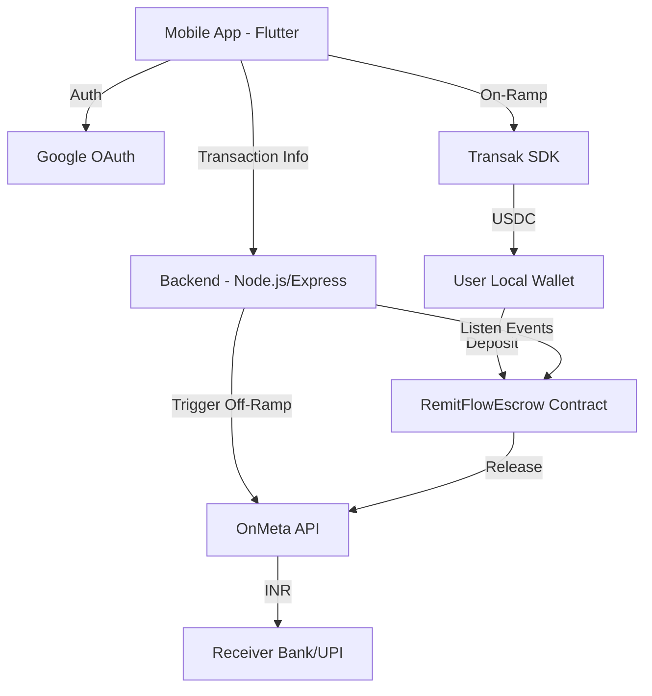

# System Design

RemitFlow follows a hybrid architecture combining traditional web services with decentralized blockchain logic.

## High-Level Diagram

## Components

### 1. Mobile Application (Frontend)
- **Role**: Entry point for users.
- **Tech**: Flutter.
- **Key Functions**:
    - Deterministic wallet generation (HMAC-SHA256).
    - On-ramp orchestration via Transak.
    - Transaction tracking and UI state management.

### 2. Backend Service (Middleware)
- **Role**: Orchestrator and data persistence.
- **Tech**: Node.js, Express, Prisma.
- **Key Functions**:
    - Listening for Polygon on-chain events (`EscrowDeposited`).
    - Syncing on-chain state with the Neon Postgres database.
    - Communicating with the OnMeta API for off-ramping.

### 3. Smart Contracts (On-Chain)
- **Role**: Trustless escrow mechanism.
- **Tech**: Solidity, Foundry.
- **Key Functions**:
    - Locking USDC until off-ramp readiness is confirmed.
    - Providing automated refunds if transactions fail.
    - Emitting events for backend synchronization.

### 4. Database (Persistence)
- **Role**: Storing user profiles and transaction history.
- **Tech**: Neon (Serverless Postgres).
- **ORM**: Prisma.

## Transfer Lifecycle

1. **Initiation**: User specifies amount and receiver details.
2. **On-Ramp**: User converts USD to USDC via Transak, deposited directly into their local deterministic wallet.
3. **Escrow Lock**: User deposits USDC into the `RemitFlowEscrow` contract.
4. **Backend Trigger**: Backend detects the deposit and verifies receiver details.
5. **Off-Ramp Call**: Backend requests OnMeta to prepare for INR credit.
6. **Funds Release**: Upon OnMeta confirmation, the backend (or an operator) releases funds from the escrow to OnMeta.
7. **Credit**: Receiver gets INR in their bank account or UPI.
